<a id="top"></a>
<div align="center">

# 🌱 GrowStation

### Dual-MCU embedded automation system for controlled-environment agriculture
### Sistema de automação embarcado com dois MCUs para agricultura em ambiente controlado

[](#)
[](#)
[](#)
[](#)

### 🇺🇸 [Read in English](#english) &nbsp;·&nbsp; 🇧🇷 [Leia em Português](#portugues)

<p align="center">
  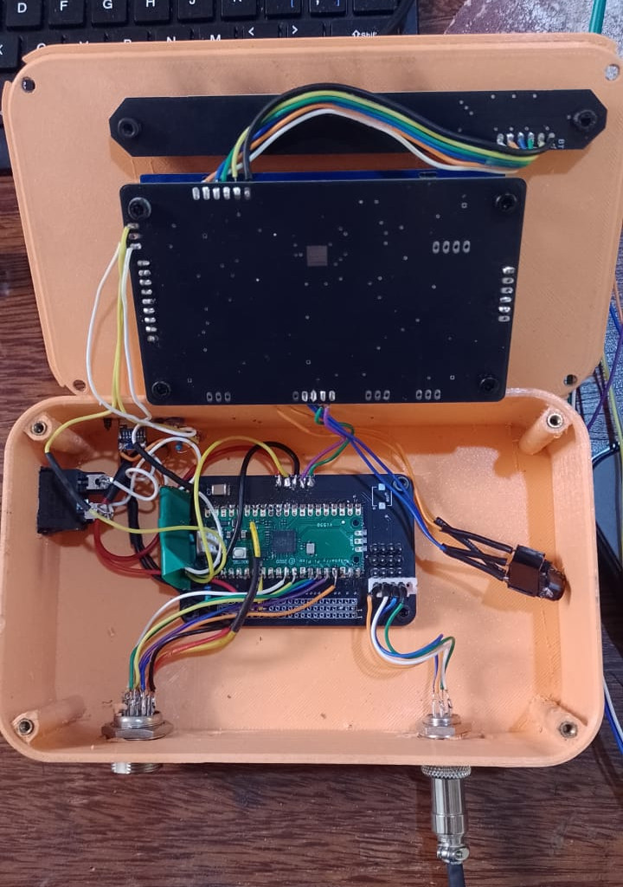
</p>

</div>

---

<a id="english"></a>
# 🇺🇸 English

> Standalone firmware for a smart grow tent controller: an ESP32 drives a touchless-feeling button UI, talks to Firebase over plain REST, and hands real-time actuator control to a dedicated RP2040 (Raspberry Pi Pico) so that watering, climate control, and lighting never stall — not even mid-OTA-update.

*This repository contains the ESP32 firmware — the supervisor-and-UI half of the system. The Raspberry Pi Pico firmware that completes it lives in a separate [complementary repository](#en-growpico).*

## Table of Contents

- [Why this project exists](#en-why)
- [System architecture](#en-architecture)
- [Hardware](#en-hardware)
- [The serial protocol](#en-protocol)
- [Firebase over plain REST](#en-firebase)
- [Display & menu system](#en-display)
- [Resilience engineering](#en-resilience)
- [Over-the-air updates](#en-ota)
- [Repository layout](#en-layout)
- [Getting started](#en-getting-started)
- [Lessons learned](#en-lessons)
- [Roadmap](#en-roadmap)
- [Complementary repository: GrowPico](#en-growpico)
- [Author](#en-author)

<a id="en-why"></a>
## Why this project exists

Most "smart" grow tent controllers on the market are either closed ecosystems locked to a single vendor's app, or hobbyist sketches that run a single loop on a single chip — meaning a Wi-Fi hiccup, a Firebase timeout, or an OTA download can freeze the very loop responsible for keeping a relay alive. For a living plant, a frozen pump relay is not a cosmetic bug.

GrowStation was built to remove that single point of failure entirely, by splitting *supervision* from *control* across two microcontrollers that never share a blocking call.

<a id="en-architecture"></a>
## System architecture

The system is deliberately asymmetric:

| | **ESP32** (this repository) | **Pico / RP2040** ([GrowPico](#en-growpico)) |
|---|---|---|
| Role | Supervisor & UI | Real-time control loop |
| Connectivity | Wi-Fi, HTTPS to Firebase | None — fully offline |
| Display | ST7796 480×320 TFT, custom menu engine | — |
| Input | 4 physical buttons w/ debounce + long-press | — |
| Storage | NVS (`Preferences`) fallback cache | — |
| Drives | Nothing directly | Pump, light, cooler, heater, humidifier, dehumidifier relays |
| Reads | — | Soil sensor, HTU21D (temp/humidity), VL53L0X (water level) |
| Failure mode | Reboots, retries Wi-Fi, falls back to cached config | Keeps watering on schedule no matter what the ESP32 is doing |

The two boards communicate over a single UART line using a protocol designed from scratch for this project — see [The serial protocol](#en-protocol). Neither board is useful on its own: this repository is one half of a system that's only complete when paired with [GrowPico](#en-growpico).

**Why two MCUs?** Because firmware updates are inherently disruptive: the ESP32 has to tear down its Firebase session, stream a binary over HTTPS, and write to flash — operations that can legitimately take tens of seconds and cannot be interrupted safely. During that entire window, the Pico keeps running its watering and climate state machines completely independently. The plant never notices that an update is happening.

**Why plain REST instead of a Firebase client library?** Early iterations used a popular Arduino Firebase client. It worked, until it didn't: undocumented reconnection behavior, callback-based APIs that hid what was actually happening on the wire, and intermittent stalls that were nearly impossible to diagnose with a logic analyzer pointed at a black box. Rewriting the client as a thin wrapper over `HTTPClient` + `WiFiClientSecure` traded a few hundred lines of boilerplate for full visibility into every request, every retry, and every failure mode.

<a id="en-hardware"></a>
## Hardware

| Component | Part | Notes |
|---|---|---|
| Supervisor MCU | ESP32 (WROOM-32) | Wi-Fi, drives the display |
| Control MCU | Raspberry Pi Pico (RP2040) | Dedicated to actuators & sensors |
| Display | ST7796, 480×320, SPI (`TFT_eSPI`) | Backlight on PWM channel 0 |
| Enclosure | Custom 3D-printed case (PLA) | Buttons and display window on front panel |
| Input | 4× tactile buttons on custom PCB, `FALLING` interrupt | Wakes the display from an ISR |
| Climate sensor | HTU21D (I²C) | Temperature + relative humidity |
| Water level sensor | VL53L0X ToF (I²C) | Reservoir distance measurement |
| Soil sensor | Capacitive analog probe | Read continuously, used informationally |
| Actuators | 6× relay channels | Light, pump, cooler, heater, humidifier, dehumidifier |
| Link between MCUs | UART, 9600 baud | Custom binary protocol, see below |

### Schematics

<p align="center">
  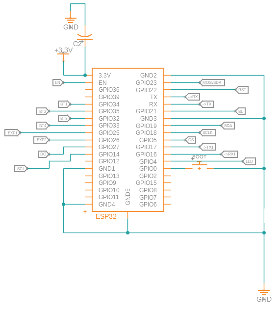
  <br>
  <em>ESP32 core sheet — full GPIO pinout and net assignments</em>
</p>

<p align="center">
  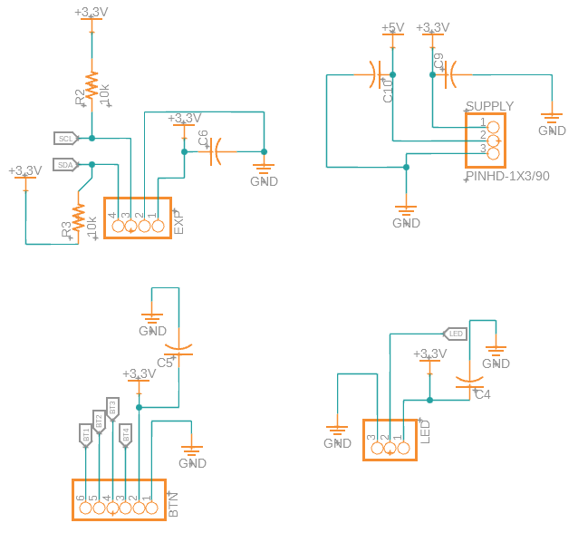
  <br>
  <em>I/O breakout sheet — UART, reset, expansion headers, display connector, and the UART link to the Pico (TARGET1)</em>
</p>

### PCB

<p align="center">
  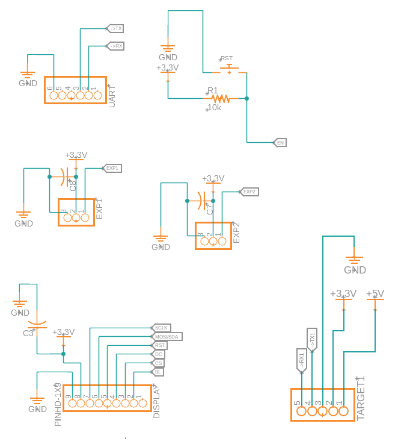
  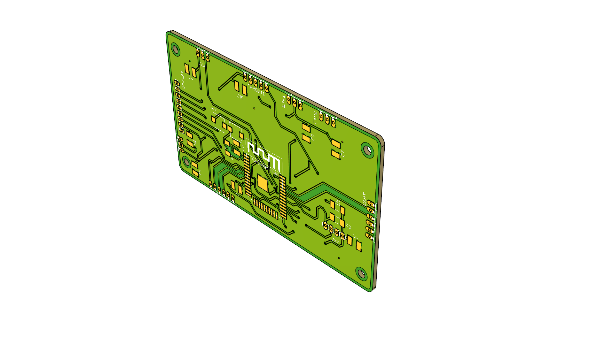
  <br>
  <em>Custom ESP32 carrier board — KiCad 3D renders</em>
</p>

### As-built internals

<p align="center">
  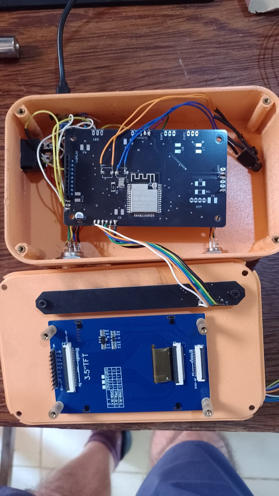
  <br>
  <em>Enclosure opened — custom ESP32 carrier PCB (top) and ST7796 3.5″ TFT board (bottom)</em>
</p>

<p align="center">
  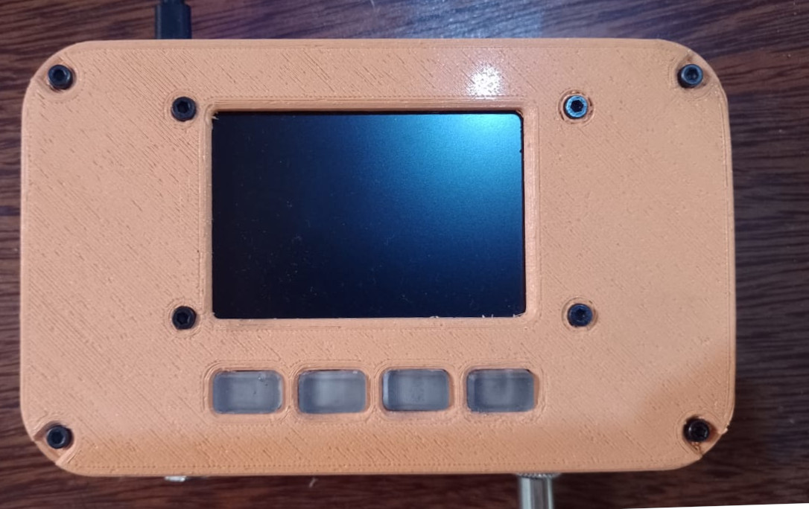
  <br>
  <em>Wide shot of the as-built internals — custom PCB, Pico, wiring harness, and panel connectors all in place</em>
</p>

### Button PCB

<p align="center">
  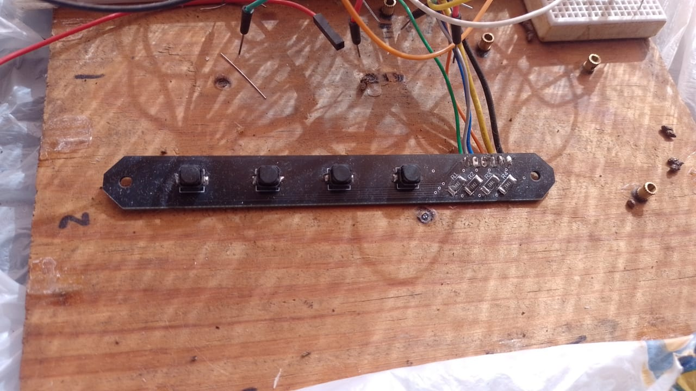
  <br>
  <em>Custom button PCB — four tactile switches with SMD pull-up resistors, wired to the main carrier board</em>
</p>

<a id="en-protocol"></a>
## The serial protocol

Two microcontrollers, one UART, zero shared memory. Every value that crosses the wire — a target temperature, a pump duration, a sensor reading — is framed in a fixed 7-byte packet:

```
┌────────┬──────┬────────┬────────┬────────┬────────┬──────────┐
│ HEADER │  ID  │ byte3  │ byte2  │ byte1  │ byte0  │ checksum │
│  0xAA  │ 1B   │  ↑──────────── uint32_t value ─────────────↓ │
└────────┴──────┴────────┴────────┴────────┴────────┴──────────┘
```

- **`HEADER` (`0xAA`)** is a resynchronization marker. If a byte gets dropped or corrupted mid-stream, the receiver discards everything until it sees `0xAA` again, rather than parsing garbage as a valid packet.
- **`ID`** identifies the payload's meaning — `0x20` is temperature, `0x07` is pump duration, `0x09` is the light status, and so on. The full table lives in [`Serial.hpp`](include/Serial.hpp).
- **The 4-byte value** is how a `float` survives a byte-oriented wire: it is multiplied by 100, truncated to a `uint32_t`, and split big-endian across four bytes. The receiver reverses the process. A `uint32_t` covers `0`–`42,949,672.95` after the division — comfortably more than any sensor or timer value this system will ever need (an earlier `uint16_t` revision topped out at 655.35 and silently overflowed on a 24-hour watering interval, which is exactly the kind of bug this format exists to prevent).
- **`checksum`** is a sum of all preceding bytes, truncated to one byte. A mismatch means the packet is dropped, never half-applied.

This protocol was designed, debugged, and hardened entirely within this project — including tracking down a byte-count mismatch where one side framed packets as 5 bytes and the other expected 7, which silently shifted every subsequent read by two bytes until the framing was unified.

<a id="en-firebase"></a>
## Firebase over plain REST

Every read and write to Firebase Realtime Database is a direct HTTPS call:

```
GET  https://<project>.firebaseio.com/<user>/InsertedData/Sensor/Temperature/TargetTemp.json?auth=<JWT>
PUT  https://<project>.firebaseio.com/<user>/Readings/Sensor/Temperature.json?auth=<JWT>
```

Authentication is handled by exchanging the user's email/password for a JWT via the Identity Toolkit endpoint, then refreshing that token before it expires — all implemented from scratch in [`FBase.cpp`](src/FBase.cpp), with zero third-party Firebase dependencies.

Two optimizations matter at scale:

- **`receiveFirebaseDataFast()`** fetches the user's entire data subtree in a *single* `GET`, then parses it locally with `ArduinoJson` — turning a 21-request startup sequence into 4 requests, roughly a 4× reduction in boot-time SSL handshakes.
- **Change-conditional writes** (`_setFloatIfChanged`, `_setBoolIfChanged`, ...) compare the new value against the current one before issuing a `PUT`, so confirming a menu screen without actually changing anything costs zero network calls.

<a id="en-display"></a>
## Display & menu system

<p align="center">
  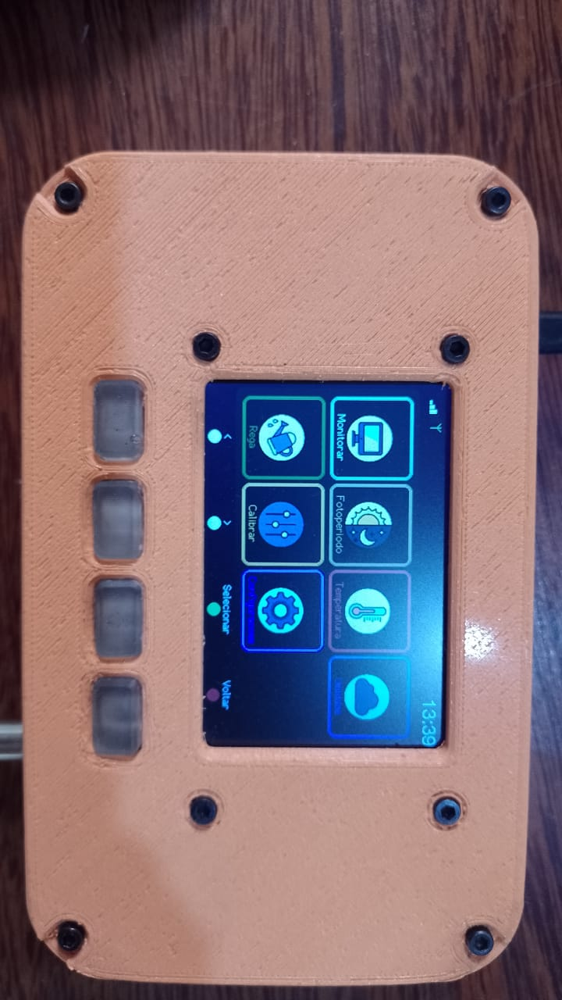
  <br>
  <em>Main menu — six navigation tiles, differential redraw keeps selection changes flicker-free</em>
</p>

The UI runs entirely on a custom rendering layer over `TFT_eSPI` — no GUI framework, no LVGL. Highlights:

- **Arc gauges** for temperature, humidity, VPD (vapor-pressure deficit, computed live), and reservoir level, each with a color-graded sweep and a target-range indicator.
- **Differential redraw**: menu tiles only repaint the cells whose selection state actually changed, instead of clearing and redrawing the whole screen every frame — keeping navigation visually flicker-free.
- **Chroma-keyed icon sprites**: RGB565 icons are pushed with a transparent background, with an edge-pixel normalization pass to clean up antialiasing artifacts against the chroma key.
- **Display health watchdog**: the controller's power-mode register is polled periodically; if it reports a dead/disconnected state, the driver attempts a guided recovery sequence without ever blocking the rest of the system.

<p align="center">
  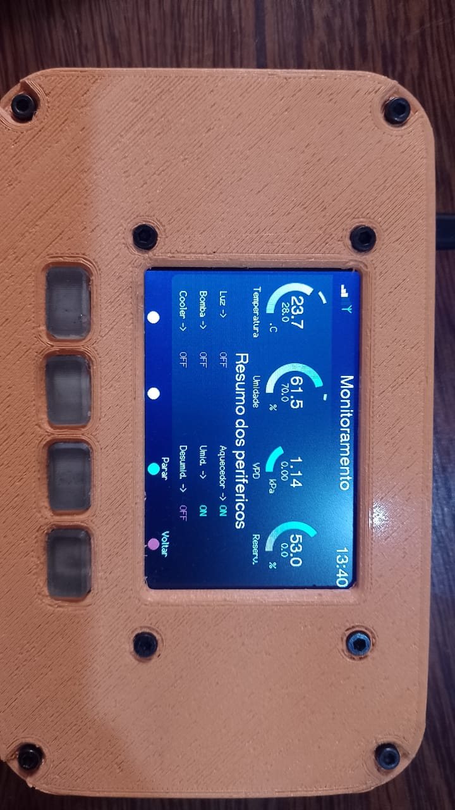
  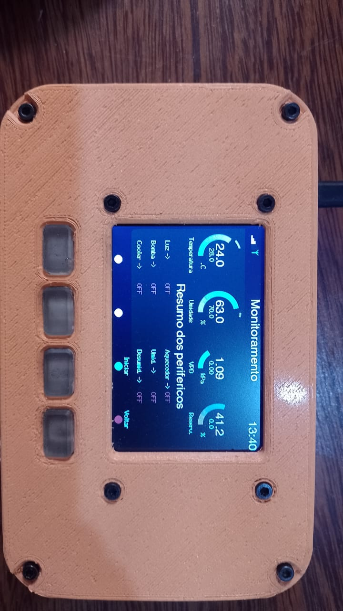
  <br>
  <em>Monitoring screen — four live arc gauges and peripheral status. Right: actuators switching ON as conditions change.</em>
</p>

<p align="center">
  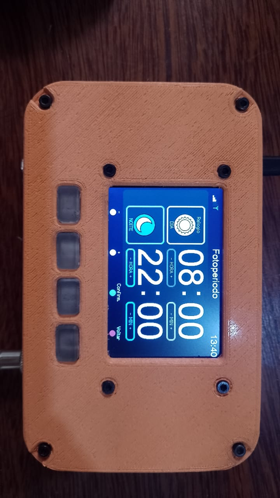
  <br>
  <em>Photoperiod menu — day/night lighting schedule configuration</em>
</p>

<a id="en-resilience"></a>
## Resilience engineering

This is the part of the project that exists almost entirely because of real-world failures observed during testing, not because of a feature list written up front.

- **Brownout-aware boot sequence.** A step-down module's output capacitor can hold a partial charge after the unit is switched off, so a quick power-cycle can re-energize the ESP32 with an unstable, slowly-rising voltage — leaving the display controller in an undefined state. The boot sequence now detects `ESP_RST_BROWNOUT` / `ESP_RST_POWERON` reset reasons and re-runs display initialization with an added settling delay before anything is drawn.
- **NVS-first boot ordering.** `Serial.begin()` and NVS flash init happen before any peripheral touches SPI, so a corrupted preferences partition is logged immediately instead of silently hanging the boot.
- **Idle-state screen dimming with a debounced wake ISR.** The backlight fades in/out on a PWM ramp driven by button inactivity; the wake interrupt has its own 50 ms software debounce to reject electrical noise on the button lines, which had previously caused the screen to wake itself spuriously.
- **Always return to the main menu after waking** — pressing a button to wake the display redraws the main menu *before* the fade-in starts, and the waking button press itself is drained so it never gets interpreted as menu navigation.
- **Watchdog-aware long operations.** Every blocking network call inside the boot sequence resets the task watchdog on a tight loop, and the watchdog itself runs at 60 s — long enough to tolerate slow SSL handshakes, short enough to recover from a true hang.
- **Heap and stack watermarking.** The main loop periodically samples free heap, the largest allocatable block, and the stack high-water mark; on detecting fragmentation or an imminent overflow, it restarts pre-emptively rather than waiting for a hard crash.
- **Offline-first configuration.** `Preferences` (NVS) mirrors every user-configurable value. On boot, Firebase is tried first when internet connectivity is confirmed via a real TCP probe to `8.8.8.8:53` (not just `WL_CONNECTED`); if that fails, the system falls back transparently to the last known-good local configuration.

<a id="en-ota"></a>
## Over-the-air updates

Firmware updates are pulled from GitHub Releases. The ESP32 fetches release metadata over its own independent TLS client (deliberately *not* sharing Firebase's connection state), shows a live progress bar on the display while streaming the binary into flash via `Update`, and only restarts after `Update.end()` confirms the write is complete and verified.

<a id="en-layout"></a>
## Repository layout

```
.
├── include/
│   ├── DataClass.hpp      # Central state: setpoints, calibration, actuator status
│   ├── FBase.hpp           # Firebase REST client (auth, GET/PUT, token refresh)
│   ├── Display.hpp         # All menu screens, gauges, and rendering helpers
│   ├── Button.hpp           # Debounced input, hold-repeat, idle tracking
│   ├── WifiManager.hpp      # Connection lifecycle + captive-portal provisioning
│   ├── Time.hpp              # NTP sync with RTC fallback
│   ├── OTA.hpp                # GitHub-Releases-based firmware updater
│   ├── Light.hpp              # Photoperiod scheduling (handles midnight wraparound)
│   ├── Serial.hpp             # Wire protocol constants & function signatures
│   └── Secrets.h.example      # ← copy to Secrets.h and fill in your credentials
├── src/
└── docs/
    └── images/
```

<a id="en-getting-started"></a>
## Getting started

```bash
# Clone
git clone https://github.com/sobreiracaio/GrowESP2.0.git
cd GrowESP2.0

# Set up credentials — never committed
cp include/Secrets.h.example include/Secrets.h
# edit include/Secrets.h with your Firebase DATABASE_URL and API_KEY

# Build & flash
pio run -t upload

# Monitor
pio device monitor -b 115200
```

On first boot with no stored Wi-Fi credentials, the ESP32 opens a captive portal (`GrowBox-Setup` / `12345678`) — connect to it and fill in your network and Firebase account credentials. These are stored in NVS at runtime and never touch the source code.

<a id="en-lessons"></a>
## Lessons learned

- **A byte-count mismatch between two ends of a serial protocol fails silently and corrupts data progressively** — it does not throw an obvious error, it just makes every reading wrong in a way that looks like sensor noise until you trace the exact byte offsets on both sides.
- **A capacitor doesn't care about your power switch.** Step-down regulators hold residual charge; a fast power-cycle is not the same event as a clean cold boot, and firmware that assumes otherwise will intermittently "just not turn on" with no software bug to find.
- **Conditional writes are not a premature optimization on a metered, latency-bound API.** Comparing before writing turned out to matter more for *responsiveness* than for bandwidth — every skipped `PUT` is one less SSL handshake blocking the next button press.
- **Splitting real-time control onto a second, more reliable MCU is a legitimate architecture pattern**, not over-engineering — especially when the supervisor MCU's job (Wi-Fi, HTTPS, OTA) is inherently the least reliable, most blocking part of the system.

<a id="en-roadmap"></a>
## Roadmap

- [ ] External RTC (DS3231) so the watering schedule survives extended power loss without internet
- [ ] Mobile companion app
- [ ] Flash encryption + secure boot
- [ ] Encrypted serial link between ESP32 and Pico

<a id="en-growpico"></a>
## 🧩 Complementary repository: GrowPico

This repository covers only the ESP32 side of the system — supervision, UI, and Firebase sync. The other half, running on the Raspberry Pi Pico and responsible for driving the relays and reading the sensors in real time, lives in its own repository. The two together make up the complete GrowStation system.

**[→ GrowPico](https://github.com/sobreiracaio/growpico)** — the real-time control loop that keeps watering, cooling, heating, and humidity control running independently of whatever the ESP32 is doing, including mid-firmware-update.

<a id="en-author"></a>
## Author

**Caio Sobreira**  
Built as a personal embedded-systems project; submitted as part of a Master's program application in Computer Science.

[↑ Back to top](#top) &nbsp;·&nbsp; 🇧🇷 [Leia em Português](#portugues)

---

<a id="portugues"></a>
# 🇧🇷 Português

> Firmware standalone para um controlador inteligente de grow tent: um ESP32 conduz uma interface de botões fluida, conversa com o Firebase via REST puro, e delega o controle de atuadores em tempo real a um RP2040 (Raspberry Pi Pico) dedicado — para que rega, controle de clima e iluminação nunca travem, nem mesmo durante uma atualização OTA.

*Este repositório contém o firmware do ESP32 — a metade supervisora e de interface do sistema. O firmware do Raspberry Pi Pico que o completa vive em um [repositório complementar](#pt-growpico) separado.*

## Sumário

- [Por que este projeto existe](#pt-por-que)
- [Arquitetura do sistema](#pt-arquitetura)
- [Hardware](#pt-hardware)
- [O protocolo serial](#pt-protocolo)
- [Firebase via REST puro](#pt-firebase)
- [Display e sistema de menus](#pt-display)
- [Engenharia de resiliência](#pt-resiliencia)
- [Atualizações over-the-air](#pt-ota)
- [Estrutura do repositório](#pt-estrutura)
- [Como começar](#pt-comecar)
- [Lições aprendidas](#pt-licoes)
- [Roadmap](#pt-roadmap)
- [Repositório complementar: GrowPico](#pt-growpico)
- [Autor](#pt-autor)

<a id="pt-por-que"></a>
## Por que este projeto existe

A maioria dos controladores "inteligentes" de grow tent é ou um ecossistema fechado preso ao aplicativo de um único fabricante, ou um sketch amador rodando um único loop em um único chip — o que significa que uma instabilidade no Wi-Fi, um timeout do Firebase, ou um download OTA podem congelar exatamente o loop responsável por manter um relé ativo. Para uma planta viva, um relé de bomba congelado não é um bug cosmético.

A GrowStation foi construída para eliminar esse ponto único de falha por completo, separando *supervisão* de *controle* entre dois microcontroladores que nunca compartilham uma chamada bloqueante.

<a id="pt-arquitetura"></a>
## Arquitetura do sistema

O sistema é deliberadamente assimétrico:

| | **ESP32** (este repositório) | **Pico / RP2040** ([GrowPico](#pt-growpico)) |
|---|---|---|
| Papel | Supervisor e interface | Loop de controle em tempo real |
| Conectividade | Wi-Fi, HTTPS para o Firebase | Nenhuma — totalmente offline |
| Display | TFT ST7796 480×320, engine de menu customizada | — |
| Entrada | 4 botões físicos com debounce e long-press | — |
| Armazenamento | NVS (`Preferences`) como cache de fallback | — |
| Controla | Nada diretamente | Relés de bomba, luz, cooler, aquecedor, umidificador, desumidificador |
| Lê | — | Sensor de solo, HTU21D (temp/umidade), VL53L0X (nível de água) |
| Modo de falha | Reinicia, tenta Wi-Fi novamente, recorre à config em cache | Mantém a rega no cronograma independente do ESP32 |

As duas placas se comunicam por uma única linha UART usando um protocolo desenhado do zero para este projeto — veja [O protocolo serial](#pt-protocolo). Nenhuma das duas placas é útil isoladamente: este repositório é metade de um sistema que só fica completo quando combinado com o [GrowPico](#pt-growpico).

**Por que dois MCUs?** Porque atualizações de firmware são inerentemente disruptivas: o ESP32 precisa encerrar sua sessão com o Firebase, transmitir um binário via HTTPS e gravar na flash — operações que podem levar dezenas de segundos e não podem ser interrompidas com segurança. Durante essa janela inteira, o Pico continua executando suas máquinas de estado de rega e clima de forma completamente independente.

**Por que REST puro em vez de uma lib cliente de Firebase?** As primeiras iterações usaram uma lib popular de Firebase para Arduino. Funcionava, até parar: comportamento de reconexão não documentado, APIs baseadas em callback que escondiam o que realmente acontecia na rede, e travamentos intermitentes quase impossíveis de diagnosticar. Reescrever o cliente como um wrapper fino sobre `HTTPClient` + `WiFiClientSecure` trocou centenas de linhas de boilerplate por visibilidade total sobre cada requisição, cada retry e cada modo de falha.

<a id="pt-hardware"></a>
## Hardware

| Componente | Peça | Observações |
|---|---|---|
| MCU supervisor | ESP32 (WROOM-32) | Wi-Fi, controla o display |
| MCU de controle | Raspberry Pi Pico (RP2040) | Dedicado a atuadores e sensores |
| Display | ST7796, 480×320, SPI (`TFT_eSPI`) | Backlight em canal PWM 0 |
| Gabinete | Caixa customizada impressa em 3D (PLA) | Botões e janela do display no painel frontal |
| Entrada | 4× botões em PCB customizada, interrupção `FALLING` | Acorda o display via ISR |
| Sensor de clima | HTU21D (I²C) | Temperatura e umidade relativa |
| Sensor de nível de água | VL53L0X ToF (I²C) | Medição de distância no reservatório |
| Sensor de solo | Sonda capacitiva analógica | Lida continuamente, uso informativo |
| Atuadores | 6× canais de relé | Luz, bomba, cooler, aquecedor, umidificador, desumidificador |
| Link entre os MCUs | UART, 9600 baud | Protocolo binário customizado, ver abaixo |

### Esquemáticos

<p align="center">
  
  <br>
  <em>Folha core do ESP32 — pinout completo e atribuição das redes</em>
</p>

<p align="center">
  
  <br>
  <em>Folha de I/O — UART, reset, headers de expansão, conector do display e o link UART para o Pico (TARGET1)</em>
</p>

### PCB

<p align="center">
  
  
  <br>
  <em>Placa customizada do ESP32 — renders 3D do KiCad</em>
</p>

### Interior montado

<p align="center">
  
  <br>
  <em>Equipamento aberto — PCB customizada do ESP32 (cima) e placa do display ST7796 3,5″ (baixo)</em>
</p>

<p align="center">
  
  <br>
  <em>Plano largo do interior montado — PCB customizada, Pico, chicote de fios e conectores de painel</em>
</p>

### PCB dos botões

<p align="center">
  
  <br>
  <em>PCB customizada dos botões — quatro chaves tácteis com resistores SMD de pull-up</em>
</p>

<a id="pt-protocolo"></a>
## O protocolo serial

Dois microcontroladores, uma UART, zero memória compartilhada. Todo valor que atravessa o fio — uma temperatura-alvo, uma duração de bomba, uma leitura de sensor — é encapsulado em um pacote fixo de 7 bytes:

```
┌────────┬──────┬────────┬────────┬────────┬────────┬──────────┐
│ HEADER │  ID  │ byte3  │ byte2  │ byte1  │ byte0  │ checksum │
│  0xAA  │ 1B   │  ↑──────────── valor uint32_t ─────────────↓ │
└────────┴──────┴────────┴────────┴────────┴────────┴──────────┘
```

- **`HEADER` (`0xAA`)** é um marcador de ressincronização. Se um byte é perdido ou corrompido no meio do fluxo, o receptor descarta tudo até ver `0xAA` de novo, em vez de interpretar lixo como um pacote válido.
- **`ID`** identifica o significado do payload — `0x20` é temperatura, `0x07` é duração da bomba, `0x09` é o status da luz, etc. A tabela completa está em [`Serial.hpp`](include/Serial.hpp).
- **O valor de 4 bytes** é como um `float` sobrevive a um fio orientado a bytes: multiplicado por 100, truncado para `uint32_t`, dividido em big-endian em quatro bytes. O receptor reverte o processo. Um `uint32_t` cobre de `0` a `42.949.672,95` após a divisão — uma revisão anterior com `uint16_t` tinha limite de 655,35 e estourava silenciosamente em um intervalo de rega de 24 horas.
- **`checksum`** é a soma de todos os bytes anteriores, truncada para um byte. Uma divergência significa que o pacote é descartado, nunca aplicado pela metade.

Esse protocolo foi desenhado, depurado e endurecido inteiramente dentro deste projeto — incluindo a investigação de uma divergência de contagem de bytes em que um lado encapsulava pacotes de 5 bytes enquanto o outro esperava 7, deslocando silenciosamente cada leitura subsequente em dois bytes.

<a id="pt-firebase"></a>
## Firebase via REST puro

Toda leitura e escrita no Firebase Realtime Database é uma chamada HTTPS direta:

```
GET  https://<projeto>.firebaseio.com/<usuario>/InsertedData/Sensor/Temperature/TargetTemp.json?auth=<JWT>
PUT  https://<projeto>.firebaseio.com/<usuario>/Readings/Sensor/Temperature.json?auth=<JWT>
```

A autenticação é feita trocando o e-mail/senha do usuário por um JWT via endpoint do Identity Toolkit, e renovando esse token antes que expire — tudo implementado do zero em [`FBase.cpp`](src/FBase.cpp), sem nenhuma dependência de terceiros do Firebase.

- **`receiveFirebaseDataFast()`** busca toda a subárvore de dados em um único `GET` e faz o parse localmente com `ArduinoJson` — transformando 21 requisições de boot em 4, aproximadamente 4× menos handshakes SSL.
- **Escritas condicionais** (`_setFloatIfChanged`, `_setBoolIfChanged`, ...) comparam o novo valor com o atual antes de disparar um `PUT` — confirmar uma tela de menu sem mudar nada custa zero chamadas de rede.

<a id="pt-display"></a>
## Display e sistema de menus

<p align="center">
  
  <br>
  <em>Menu principal — seis blocos de navegação, redesenho diferencial mantém a navegação sem flicker</em>
</p>

A interface roda inteiramente sobre uma camada de renderização customizada por cima do `TFT_eSPI` — sem framework de GUI, sem LVGL. Destaques:

- **Gauges em arco** para temperatura, umidade, VPD (déficit de pressão de vapor, calculado ao vivo) e nível do reservatório, cada um com gradiente de cor e indicador de faixa-alvo.
- **Redesenho diferencial**: os blocos do menu só repintam as células cujo estado de seleção mudou, mantendo a navegação livre de flicker.
- **Sprites de ícone com chroma key**: ícones RGB565 com fundo transparente e passagem de normalização de pixels de borda.
- **Watchdog de saúde do display**: o registrador de modo de energia do controlador é consultado periodicamente; estado anormal dispara sequência de recuperação sem bloquear o restante do sistema.

<p align="center">
  
  
  <br>
  <em>Tela de monitoramento — quatro gauges ao vivo e status dos periféricos. Direita: atuadores ligando conforme as condições mudam.</em>
</p>

<p align="center">
  
  <br>
  <em>Menu de fotoperíodo — configuração do horário de iluminação (08:00 ligar / 22:00 desligar)</em>
</p>

<a id="pt-resiliencia"></a>
## Engenharia de resiliência

Esta parte do projeto existe quase inteiramente por causa de falhas reais observadas durante os testes.

- **Sequência de boot consciente de brownout.** O capacitor de saída de um módulo step-down pode manter carga parcial após o desligamento — um power-cycle rápido pode realimentar o ESP32 com tensão instável, deixando o controlador do display em estado indefinido. O boot detecta `ESP_RST_BROWNOUT` / `ESP_RST_POWERON` e reinicializa o display com delay extra antes de qualquer desenho.
- **Ordem de boot priorizando NVS.** `Serial.begin()` e init NVS acontecem antes de qualquer periférico tocar o SPI — partição corrompida é registrada imediatamente em vez de travar silenciosamente.
- **Escurecimento de tela com ISR de wake debounced.** Backlight em rampa PWM por inatividade; interrupção de wake com debounce de 50 ms para rejeitar ruído elétrico.
- **Sempre retorna ao menu principal após acordar** — redesenha o menu *antes* do fade-in, e drena o pressionamento de botão que acordou a tela para que não seja interpretado como navegação.
- **Operações longas conscientes do watchdog.** Toda chamada bloqueante reseta o task watchdog em loop apertado; watchdog a 60 s.
- **Monitoramento de heap e stack.** Loop principal amostra heap livre, maior bloco alocável e marca d'água da stack; reinicia preventivamente ao detectar fragmentação ou overflow iminente.
- **Configuração offline-first.** `Preferences` espelha toda config. Firebase tentado primeiro com sondagem TCP real para `8.8.8.8:53`; em caso de falha, recorre à última config local válida.

<a id="pt-ota"></a>
## Atualizações over-the-air

Atualizações de firmware são buscadas no GitHub Releases. O ESP32 usa seu próprio cliente TLS independente (não compartilhando o estado do Firebase), mostra barra de progresso ao vivo no display durante o streaming do binário via `Update`, e só reinicia após `Update.end()` confirmar a escrita completa e verificada.

<a id="pt-estrutura"></a>
## Estrutura do repositório

```
.
├── include/
│   ├── DataClass.hpp      # Estado central: setpoints, calibração, status dos atuadores
│   ├── FBase.hpp           # Cliente REST do Firebase (auth, GET/PUT, renovação de token)
│   ├── Display.hpp         # Todas as telas de menu, gauges e helpers de renderização
│   ├── Button.hpp           # Entrada com debounce, hold-repeat, rastreamento de ociosidade
│   ├── WifiManager.hpp      # Ciclo de vida da conexão + provisionamento via captive-portal
│   ├── Time.hpp              # Sincronização NTP com fallback de RTC
│   ├── OTA.hpp                # Atualizador de firmware via GitHub Releases
│   ├── Light.hpp              # Agendamento de fotoperíodo (trata virada de meia-noite)
│   ├── Serial.hpp             # Constantes do protocolo e assinaturas de funções
│   └── Secrets.h.example      # ← copie para Secrets.h e preencha com suas credenciais
├── src/
└── docs/
    └── images/
```

<a id="pt-comecar"></a>
## Como começar

```bash
# Clonar
git clone https://github.com/sobreiracaio/GrowESP2.0.git
cd GrowESP2.0

# Configurar credenciais — nunca commitadas
cp include/Secrets.h.example include/Secrets.h
# edite include/Secrets.h com seu DATABASE_URL e API_KEY do Firebase

# Compilar e gravar
pio run -t upload

# Monitorar
pio device monitor -b 115200
```

No primeiro boot sem credenciais de Wi-Fi salvas, o ESP32 abre um captive portal (`GrowBox-Setup` / `12345678`) — conecte-se e configure sua rede e conta do Firebase. Esses dados ficam em NVS em runtime e nunca tocam o código-fonte.

<a id="pt-licoes"></a>
## Lições aprendidas

- **Uma divergência na contagem de bytes entre dois lados de um protocolo serial falha silenciosamente** — não lança erro óbvio, apenas faz cada leitura ficar errada de um jeito que parece ruído de sensor até você rastrear os offsets exatos.
- **Um capacitor não se importa com seu interruptor de energia.** Reguladores step-down retêm carga residual; power-cycle rápido não é boot a frio limpo.
- **Escritas condicionais não são otimização prematura em API limitada e sensível a latência.** Cada `PUT` evitado é um handshake SSL a menos bloqueando o próximo aperto de botão.
- **Separar o controle em tempo real para um segundo MCU mais simples e confiável é padrão de arquitetura legítimo** — especialmente quando o MCU supervisor (Wi-Fi, HTTPS, OTA) é inerentemente a parte menos confiável do sistema.

<a id="pt-roadmap"></a>
## Roadmap

- [ ] RTC externo (DS3231) para sobreviver a quedas de energia prolongadas sem internet
- [ ] Aplicativo mobile companheiro
- [ ] Criptografia de flash + secure boot
- [ ] Link serial criptografado entre o ESP32 e o Pico

<a id="pt-growpico"></a>
## 🧩 Repositório complementar: GrowPico

Este repositório cobre apenas o lado do ESP32 do sistema. A outra metade, que roda no Raspberry Pi Pico e aciona os relés e lê os sensores em tempo real, vive em seu próprio repositório. Os dois juntos formam o sistema GrowStation completo.

**[→ GrowPico](https://github.com/sobreiracaio/growpico)** — o loop de controle em tempo real que mantém rega, refrigeração, aquecimento e controle de umidade funcionando independentemente do ESP32, inclusive durante atualizações de firmware.

<a id="pt-autor"></a>
## Autor

**Caio Sobreira**  
Construído como projeto pessoal de sistemas embarcados; submetido como parte de um processo de seleção de mestrado em Ciência da Computação.

[↑ Voltar ao topo](#top) &nbsp;·&nbsp; 🇺🇸 [Read in English](#english)
